# Haven · Omarchy 4

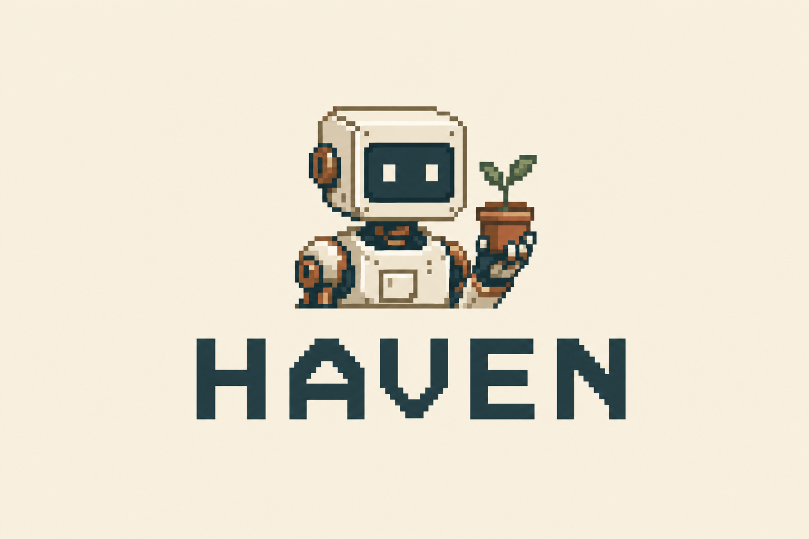

A light pixel art theme for Omarchy, set in a peaceful, inhabited corner of the world of Outpost.

[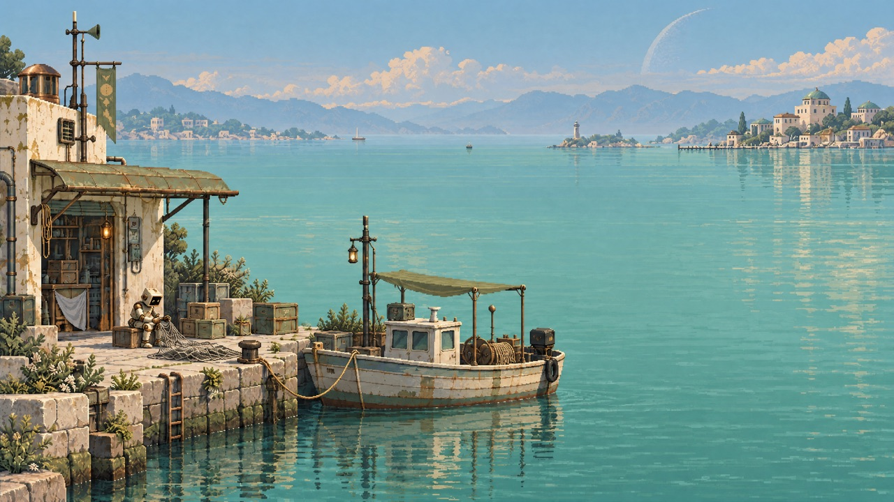](backgrounds/01-little-harbour.png)

## Backgrounds

Twelve wallpapers, all 3840 × 2160. Click a preview to open the full-resolution PNG.

| | | |
| --- | --- | --- |
| [](backgrounds/01-little-harbour.png)<br>Little harbour | [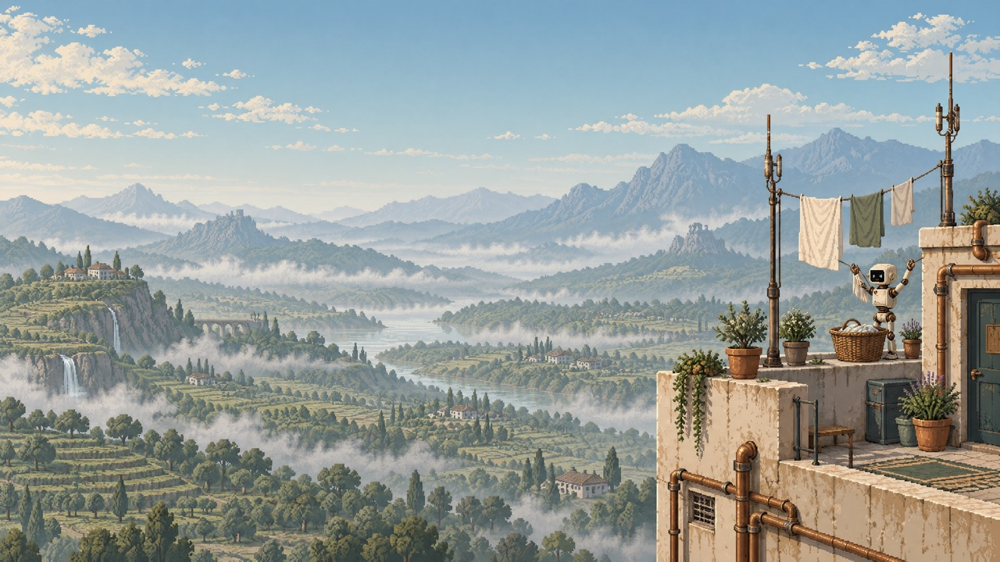](backgrounds/02-rooftop-laundry.png)<br>Rooftop laundry | [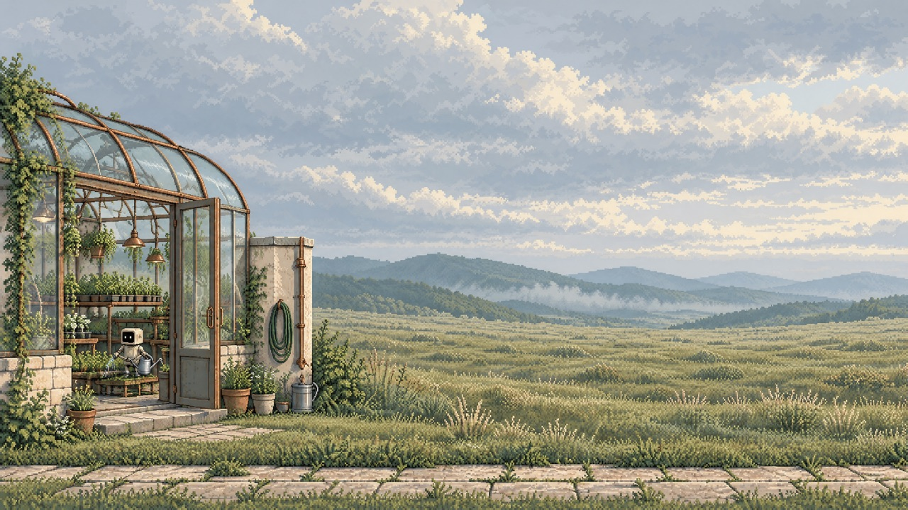](backgrounds/03-morning-greenhouse.png)<br>Morning greenhouse |
| [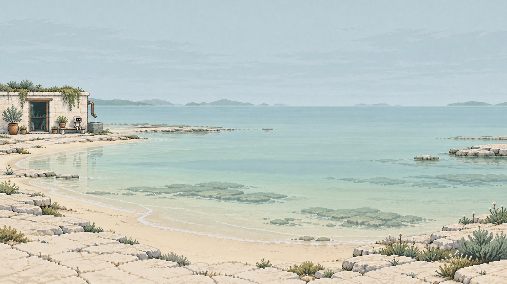](backgrounds/04-limestone-cove.png)<br>Limestone cove | [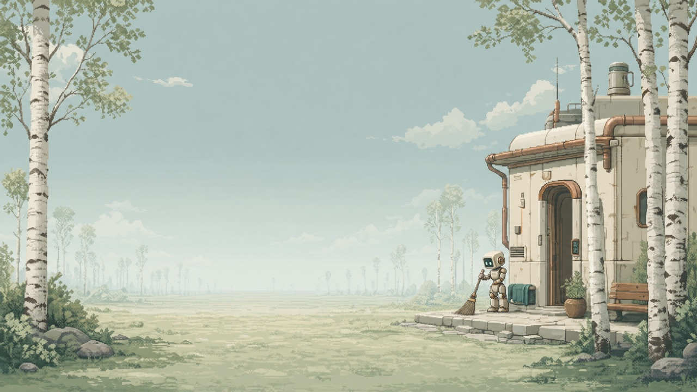](backgrounds/05-birch-clearing.png)<br>Birch clearing | [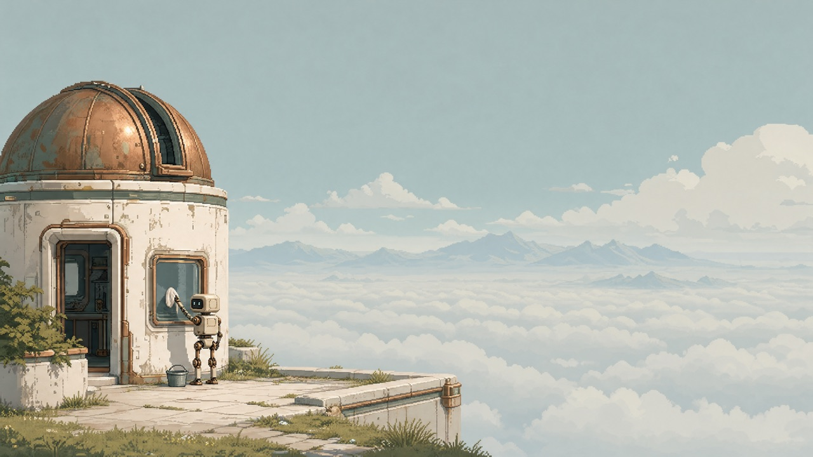](backgrounds/06-cloud-observatory.png)<br>Cloud observatory |
| [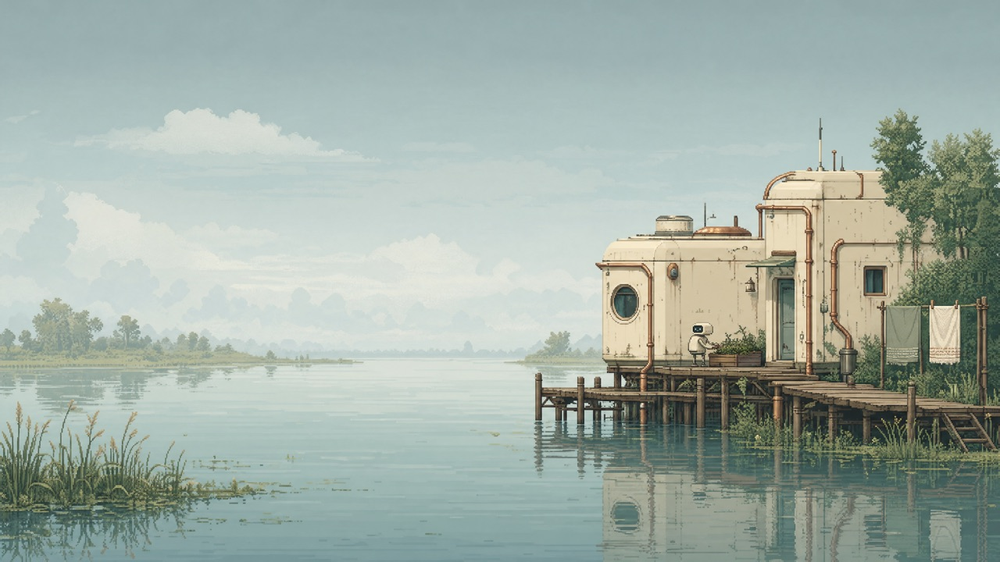](backgrounds/07-river-delta.png)<br>River delta | [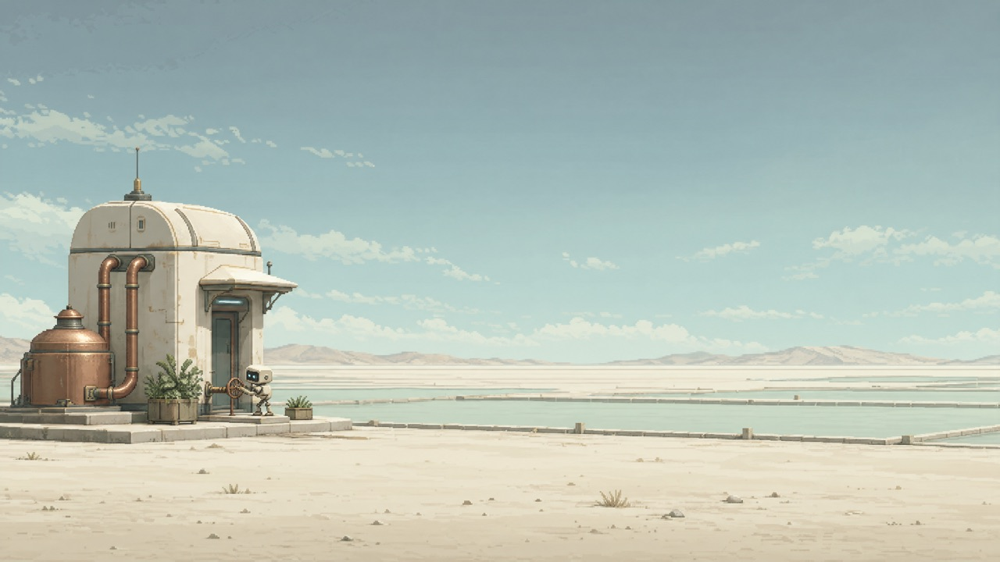](backgrounds/08-salt-water-garden.png)<br>Salt water garden | [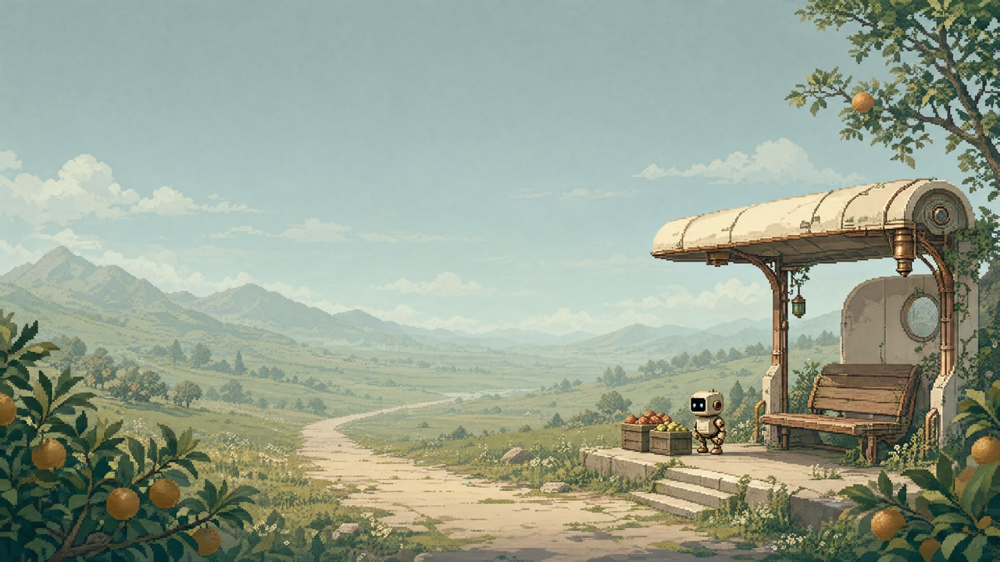](backgrounds/09-orchard-stop.png)<br>Orchard stop |
| [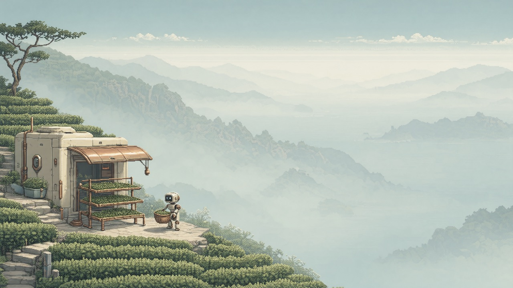](backgrounds/10-tea-terraces.png)<br>Tea terraces | [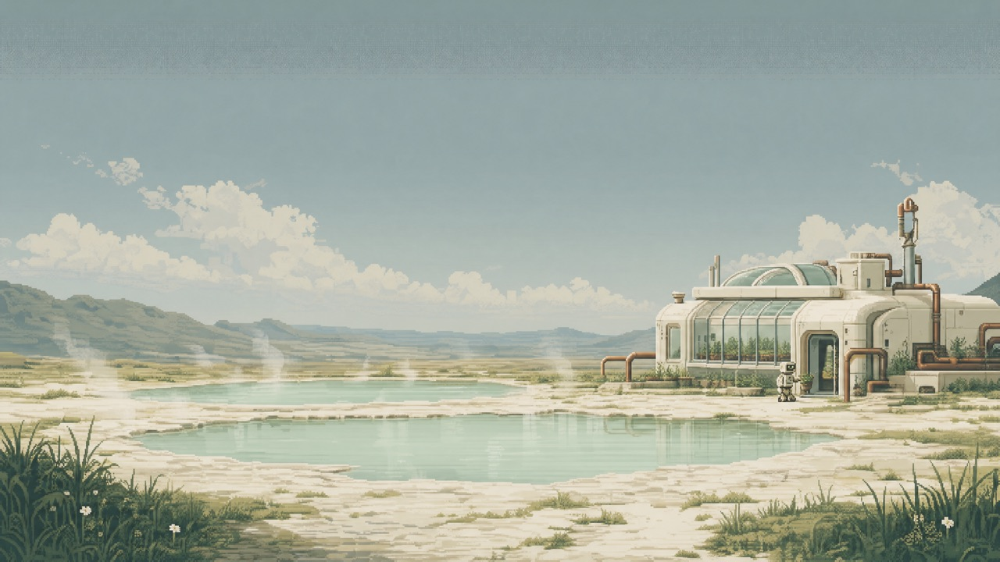](backgrounds/11-geothermal-gardens.png)<br>Geothermal gardens | [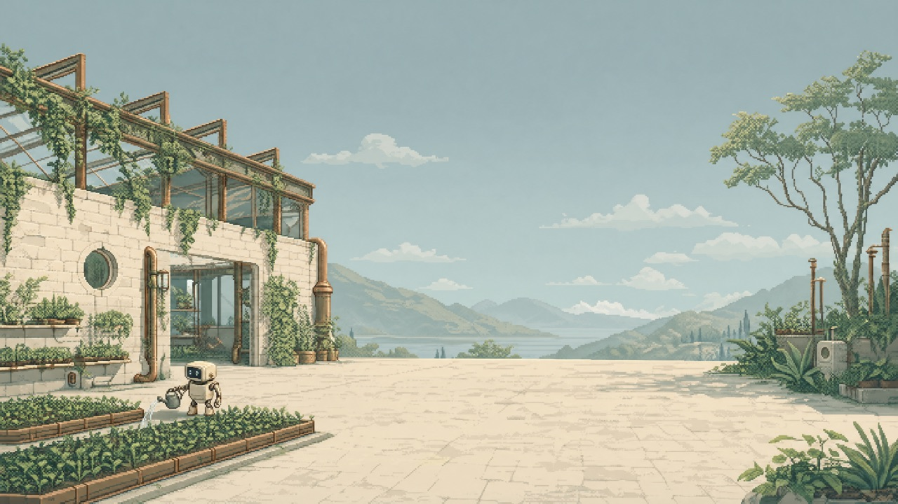](backgrounds/12-ruins-nursery.png)<br>Nursery in the ruins |

## Inspiration

Small maintenance robots tend gardens, mend nets and hang laundry among weathered retrofuturistic buildings. Open water, meadows and mist give each scene room to breathe. Warm ivory, petroleum, sage and aged copper connect Haven to Outpost, with a shared light palette that stays consistent as wallpapers change.

## Related themes

Haven is the light companion to [Outpost](https://github.com/simoz/omarchy-outpost-theme), a dark theme of remote stations and wild landscapes. Both share the same pixel art world, maintenance robots and palette of petroleum, bronze and ivory.

## Installation

Run this command on your Omarchy 4 machine:

```sh
omarchy theme install https://github.com/simoz/omarchy-haven-theme
```

To switch back, select your previous theme from Omarchy's theme menu.

## Unlock screen

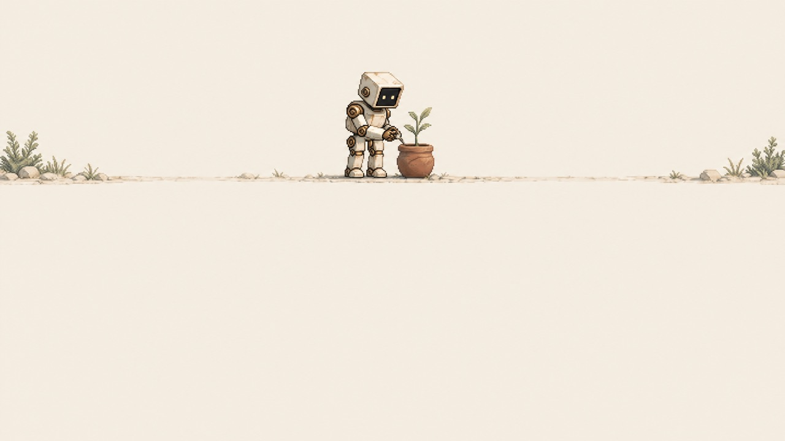

## About

[The optional About artwork](about.txt) shows a block-art robot with **STILL HERE. THINGS GROW.** beneath it.

After installing the theme, run these commands on your Omarchy machine. Save a copy of any existing custom About artwork first; the copy command replaces it.

```sh
mkdir -p ~/.config/omarchy/branding
cp ~/.config/omarchy/themes/haven/about.txt ~/.config/omarchy/branding/about.txt
```

Close and reopen **About** to see the change. This is a personal branding setting: selecting or updating Haven does not copy it automatically, and switching themes does not remove it.

## Screensaver

[The optional screensaver](screensaver.txt) pairs the same robot with the Haven wordmark and **STILL HERE. THINGS GROW.** Omarchy supplies the animation effects.

After installing the theme, run these commands to activate it. Save a copy of any existing custom screensaver first.

```sh
mkdir -p ~/.config/omarchy/branding
cp ~/.config/omarchy/themes/haven/screensaver.txt ~/.config/omarchy/branding/screensaver.txt
```

Open **System → Screensaver** to preview it. Like About, this is a personal setting that remains when switching themes.

## Shell

Ivory and sand surfaces, petroleum text and copper borders carry through the bar, menus, launcher, notifications and authentication dialogs. Selected rows use a solid mist-green background. `shell.toml` defines the appearance; personal shell settings take precedence.

## Palette

| Role | Color |
| --- | --- |
| Mineral ivory background | `#EEE8DA` |
| Sand surfaces | `#E2DAC9` |
| Petroleum text | `#263D40` |
| Copper accent | `#795334` |
| Sage | `#4C6045` |
| Selection | `#CEDBD5` |
| Secondary text | `#526056` |

`colors.toml` contains the complete palette, including bright terminal variants. `icons.theme` selects `Yaru-wartybrown`.

Opaque-color contrast: primary text 9.42:1 on the background; primary text 8.07:1 on selection; secondary text 4.77:1 on sand surfaces. The semantic terminal colors exceed 4.5:1 on the main background.

## Compatibility

The theme uses the Omarchy 4 central palette format. Omarchy generates application configurations from its [official templates](https://github.com/omacom/omarchy/tree/quattro/default/themed); `shell.toml` customizes the shared shell surfaces.

## Image credits

Artwork created for Haven with OpenAI image generation. Wallpapers are 3840 × 2160, with no post-generation upscaling; gallery previews are reduced copies.

## License

See the [MIT License](LICENSE).
